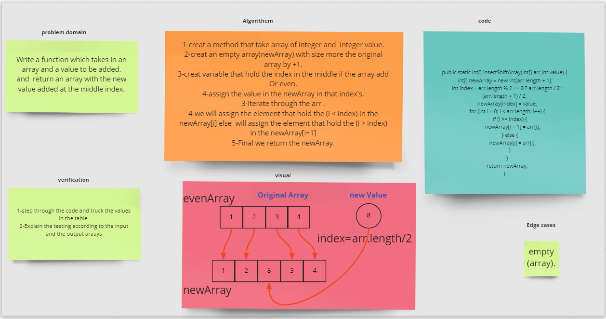

# 401-data-structures-and-algorithms

|*title*|*link to challenge doc & whiteboard*|*link to code*|
|------------|-------------------------|-------------|
| code challenge 01|[whiteboard of array reverse](./codeChallenges/array-reverse)|[Reverse an array](codeChallenges/array-reverse/README.md)|
| code challenge 02|[whiteboard of array Shift](codeChallenges/array-insert-shift/lib/src/main/java/array/insert/shift)|[Array Shift](codeChallenges/array-insert-shift/lib/src/main/java/array/insert/shift/README.md)|

### Reverse an Array
    reverseArray function takes in an array as an argument return an array with elements in reversed order
### Whiteboard Process

### Approach & Efficiency
    
    Big o(n)

### shift an Array
    insertShiftArray is a function takes in an array as an argument and value as integer return an newArray that containe the value in the middle 
### Whiteboard Process

### Approach & Efficiency

    Big o(n)