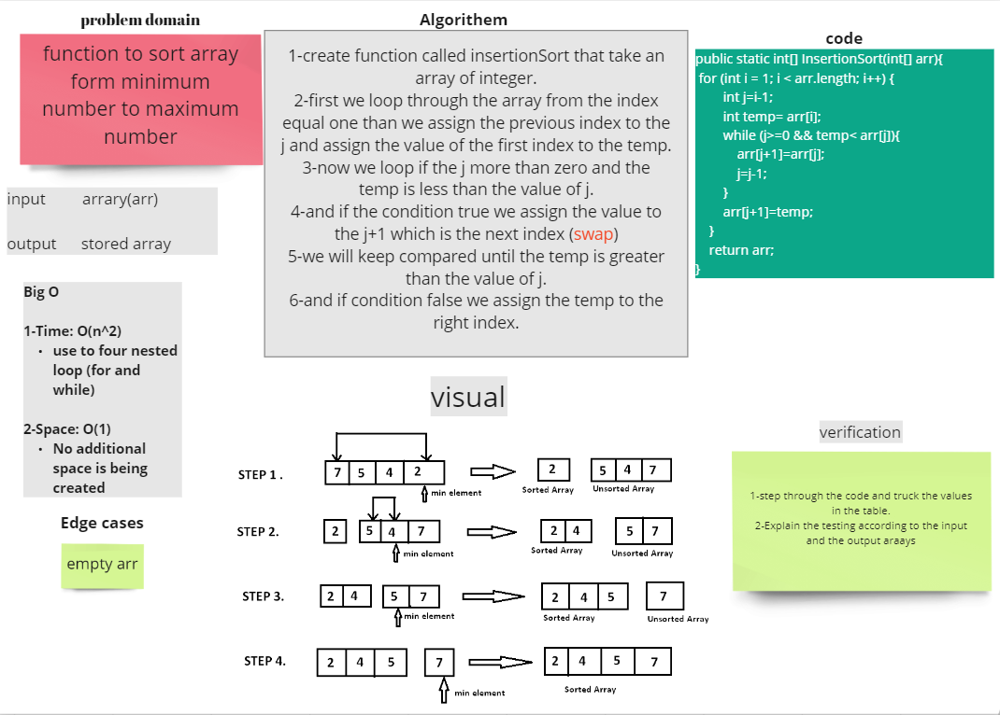

# Challenge Summary
function to sort array form minimum number to maximum number

## Whiteboard Process

## Approach & Efficiency
`InsertionSort`
- Time: O(n^2)
  - The basic operation of this algorithm is comparison. This will happen n * (n-1) number of times…concluding the algorithm to be n squared.
- Space: O(1)
  - No additional space is being created. This array is being sorted in place…keeping the space at constant O(1).
## Solution

~~~java
   public static int[] InsertionSort(int[] arr){
        for (int i = 1; i < arr.length; i++) {
        int j=i-1;
        int temp= arr[i];
        while (j>=0 && temp< arr[j]){
        arr[j+1]=arr[j];
        j=j-1;
        }
        arr[j+1]=temp;
        }
        return arr;
        }
~~~
