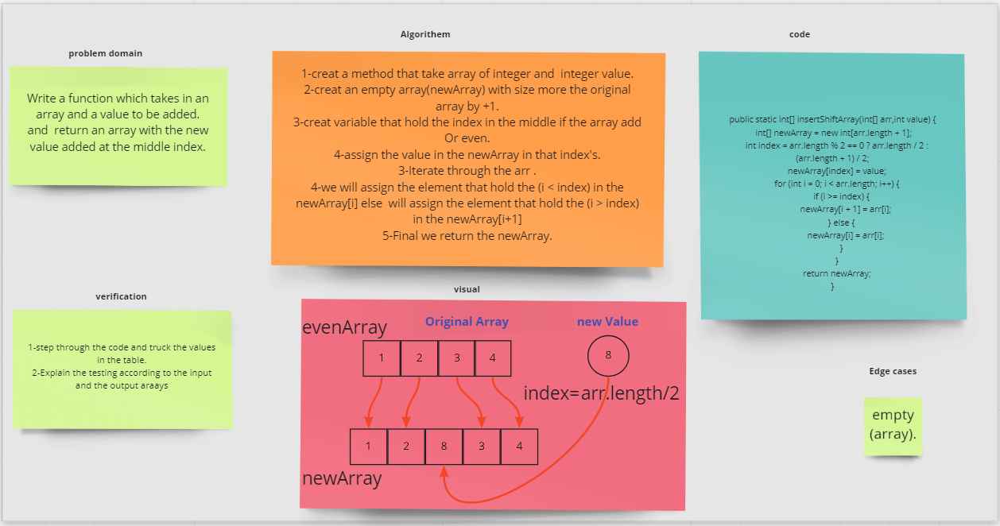

# Array shift

### shift an Array
    insertShiftArray is a function takes in an array as an argument and value as integer return an newArray that containe the value in the middle 
### Whiteboard Process

### Approach & Efficiency

    Big o(n)

##code 

~~~java
    public static int[] insertShiftArray(int[] arr,int value) {
        int[] newArray = new int[arr.length + 1];
        int index = arr.length % 2 == 0 ? arr.length / 2 : (arr.length + 1) / 2;
        newArray[index] = value;
        for (int i = 0; i < arr.length; i++) {
            if (i >= index) {
                newArray[i + 1] = arr[i];
            } else {
                newArray[i] = arr[i];
            }
        }
        return newArray;
    }
~~~