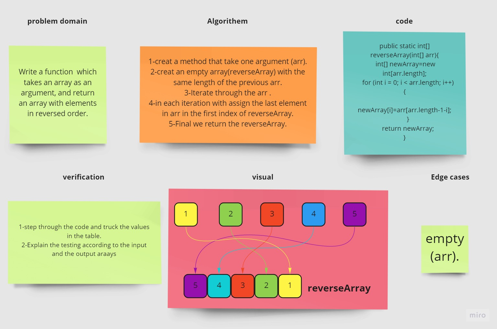

# arrayReverse

### Reverse an Array
    reverseArray function takes in an array as an argument return an array with elements in reversed order
### Whiteboard Process

### Approach & Efficiency

    Big o(n)


## code 
```java

    public static int[] reverseArray(int[] arr){
        int[] newArray=new int[arr.length];
        for (int i = 0; i < arr.length; i++) {
            newArray[i]=arr[arr.length-1-i];
        }
        return newArray;
    }
```