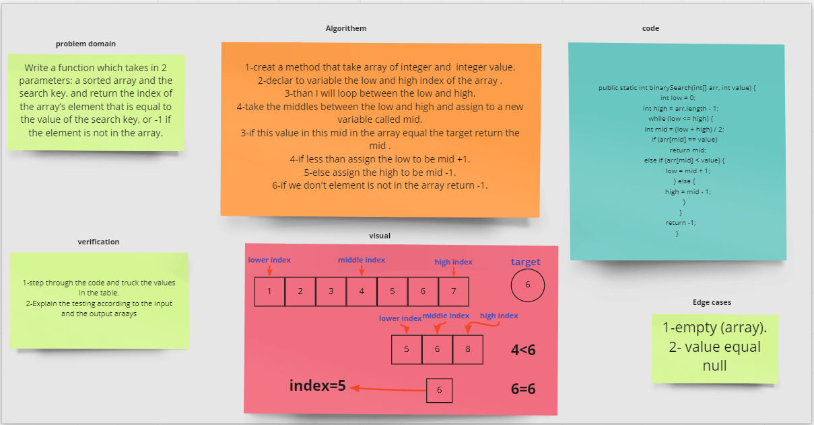

# Reverse an Array
>`BinarySearch` function takes in 2 parameters: a sorted array, and the search key and return the index of the array’s element that is equal to the value of the search key, or -1 if the element is not in the array.

## Whiteboard Process

## Approach & Efficiency
bigO(log(n))

#code
~~~java
public static int binarySearch(int[] arr, int value) {
        int low = 0;
        int high = arr.length - 1;
        while (low <= high) {
            int mid = (low + high) / 2;
            if (arr[mid] == value)
                return mid;
            else if (arr[mid] < value) {
                low = mid + 1;
            } else {
                high = mid - 1;
            }
        }
        return -1;
    }
~~~