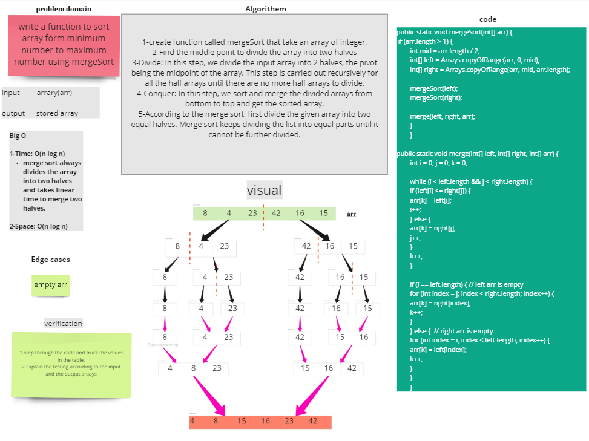

## Challenge Summary

Solve the merge sort problem and blog about it.

## Challenge Description

Examine the pseudocode below, then follow the steps using the given example array to trace the
method. Document your reasoning by writing a blog post that includes a visual representation of the
result after each iteration. Once you've finished your article, use the pseudocode given to create a
functioning, tested Merge Sort solution.

## Approach & Efficiency

I started by reading the instructions and looking at the pseudocode. Then I prepared the files I'd
require for this assignment. I then wrote the blog using the blog example as a guide. I sketched up
the blog's whiteboard and jotted down a quick rundown of the code. For this task, the Big O is space
O(n log n), while the Big O is time O(n log n).

## Solution

~~~java
    public static int[] mergeSort(int[] arr) {

        if (arr.length > 1) {
        int mid = arr.length / 2;
        int[] left = Arrays.copyOfRange(arr, 0, mid);
        int[] right = Arrays.copyOfRange(arr, mid, arr.length);
        mergeSort(left);
        mergeSort(right);
        merge(left, right, arr);
        }

        return arr;
        }

public static void merge(int[] left, int[] right, int[] arr) {
        int i = 0, j = 0, k = 0;

        while (i < left.length && j < right.length) {
        if (left[i] <= right[j]) {
        arr[k] = left[i];
        i++;
        } else {
        arr[k] = right[j];
        j++;
        }
        k++;
        }

        if (i == left.length) { // left arr is empty
        for (int index = j; index < right.length; index++) {
        arr[k] = right[index];
        k++;
        }
        } else {  // right arr is empty
        for (int index = i; index < left.length; index++) {
        arr[k] = left[index];
        k++;
        }
        }
        }
~~~