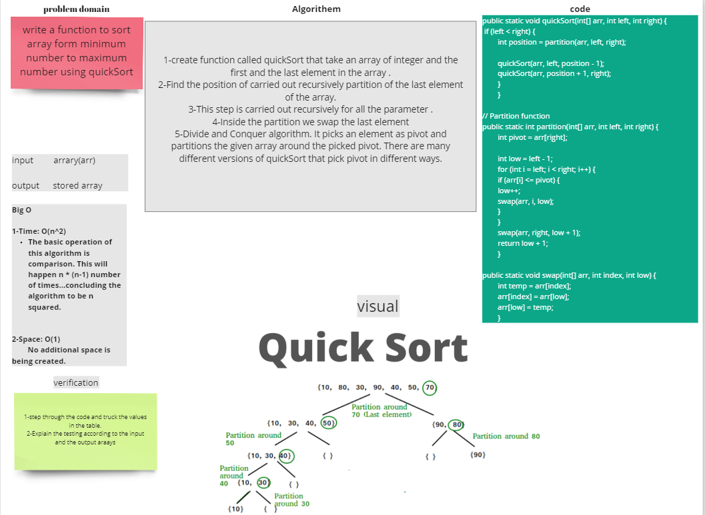

## Challenge Summary

quickSort->> function to sort array form minimum number to maximum number

## Challenge Description

Examine the pseudocode below, then follow the steps using the given example array to trace the
method. Document your reasoning by writing a blog post that includes a visual representation of the
result after each iteration. Once you've finished your article, use the pseudocode given to create a
functioning, tested version of Quick Sort.

## Approach & Efficiency

I started by reading the instructions and looking at the pseudocode. Then I prepared the files I'd
require for this assignment. I then wrote the blog using the blog example as a guide. I sketched up
the blog's whiteboard and jotted down a quick rundown of the code. For this challenge, the Big O is
space O(1), and the Big O is time O(n2).

## Solution

~~~java
    public static void quickSort(int[] arr, int left, int right) {
        if (left < right) {
        int position = partition(arr, left, right);

        quickSort(arr, left, position - 1);
        quickSort(arr, position + 1, right);
        }
        }

// Partition function
public static int partition(int[] arr, int left, int right) {
        int pivot = arr[right];

        int low = left - 1;
        for (int i = left; i < right; i++) {
        if (arr[i] <= pivot) {
        low++;
        swap(arr, i, low);
        }
        }
        swap(arr, right, low + 1);
        return low + 1;
        }

public static void swap(int[] arr, int index, int low) {
        int temp = arr[index];
        arr[index] = arr[low];
        arr[low] = temp;
        }
~~~