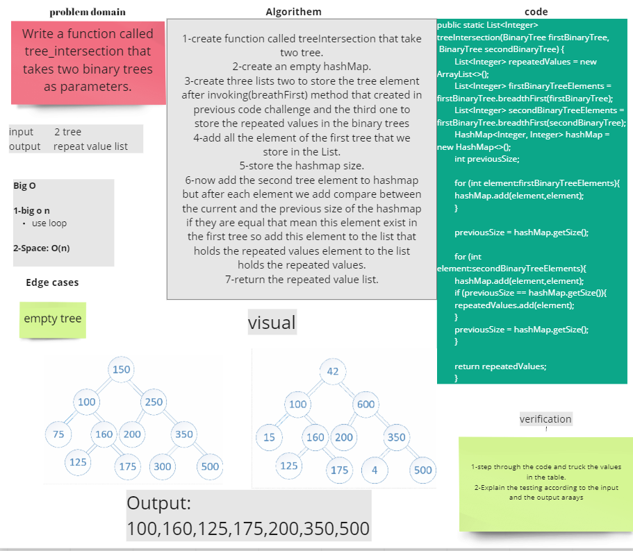

# Challenge Summary

Create a HashMapTreeIntersection function that accepts two binary Search tree inputs. 
Return a HashMap of the values discovered in both trees without using any of your language's built-in library functions.
## Whiteboard Process

## Approach & Efficiency

The Big O space is O(n), and the time is O(n).

## Solution

~~~java
    public static List<Integer> treeIntersection(BinaryTree firstBinaryTree,
        BinaryTree secondBinaryTree) {
        List<Integer> repeatedValues = new ArrayList<>();
        List<Integer> firstBinaryTreeElements = firstBinaryTree.breadthFirst(firstBinaryTree);
        List<Integer> secondBinaryTreeElements = firstBinaryTree.breadthFirst(secondBinaryTree);
        HashMap<Integer, Integer> hashMap = new HashMap<>();
        int previousSize;

        for (int element:firstBinaryTreeElements){
        hashMap.add(element,element);
        }

        previousSize = hashMap.getSize();

        for (int element:secondBinaryTreeElements){
        hashMap.add(element,element);
        if (previousSize == hashMap.getSize()){
        repeatedValues.add(element);
        }
        previousSize = hashMap.getSize();
        }

        return repeatedValues;
        }
~~~