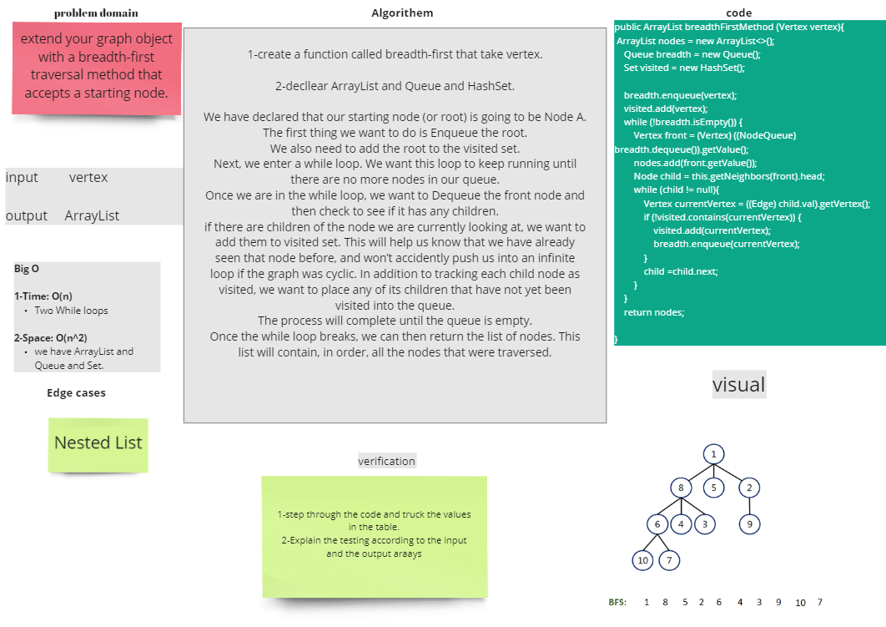
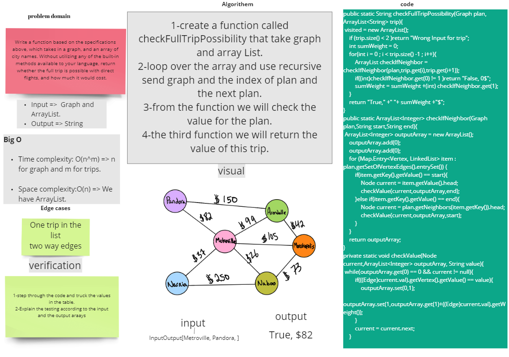

# Graphs
Implementing Graph.

## Challenge
Implementing Graph. The graph should be represented as an adjacency list, and should include the following methods:

* AddNode()
    * Adds a new node to the graph
    * Takes in the value of that node
    * Returns the added node
* AddEdge()
    * Adds a new edge between two nodes in the graph
    * Include the ability to have a “weight”
    * Takes in the two nodes to be connected by the edge
    * Both nodes should already be in the Graph
* GetNodes()
    * Returns all of the nodes in the graph as a collection (set, list, or similar)
* GetNeighbors()
    * Returns a collection of edges connected to the given node
    * Takes in a given node
    * Include the weight of the connection in the returned collection
* Size()
    * Returns the total number of nodes in the graph

## Approach & Efficiency
#### Time complexity:-
    * addNode(): O(1) => no loops;
    * addEdge(): O(1) => no loops;
    * getNodes(): O(n) => for loops;
    * getNeighbors(): O(1) => no loops;
    * size(): O(1) => no loops;

#### Space complexity:
    * addNode(): O(1) => no additional storage;
    * addEdge(): O(1) => no additional storage;
    * getNodes(): O(n) => add Set;
    * getNeighbors(): O(1) => no additional storage;
    * size(): O(1) => no additional storage;

# Graphs BreadthFirst
Implementing Graphs BreadthFirst.

## Challenge
Extend your graph object with a breadth-first traversal method that accepts a starting node. Without utilizing any of the built-in methods available to your language, return a collection of nodes in the order they were visited. Display the collection.

## Approach & Efficiency
#### Time complexity:-
    * breadthFirstMethod(): O(n^2) => Two While loops;

#### Space complexity:
    * breadthFirstMethod(): O(n^3) => We have ArrayList, Queue and Set.

## Solution

# Graphs BreadthFirst
Implementing check  whether the full trip is possible with direct flights, and how much it would cost.

## Challenge 37
Write a function based on the specifications above, which takes in a graph, and an array of city names. Without utilizing any of the built-in methods available to your language, return whether the full trip is possible with direct flights, and how much it would cost.
## Approach & Efficiency
#### Time complexity:-
    * checkFullTripPossibility(): O(n^3) => Two for loops and While;

#### Space complexity:
    * checkFullTripPossibility(): O(n) => We have ArrayList.

## Solution

