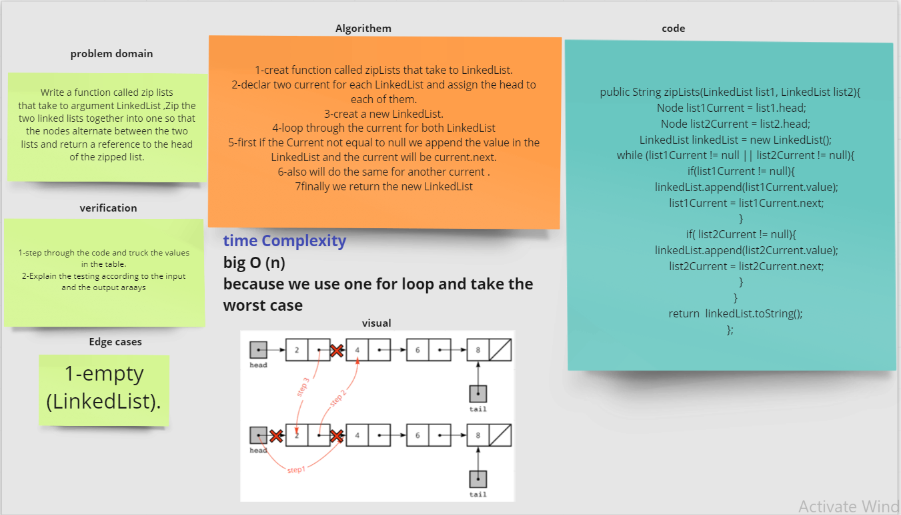

# Singly Linked List

Linked List is a linear data structure. Unlike arrays, linked list elements are not stored at a contiguous location; the elements are linked using pointers.

## Challenge

**create singly LinkedList and implement some method like insert and include and toString** 

## Approach & Efficiency

**insert:** bigO(1)
**include:** bigO(n),because we use While loop
**toString:** bigO(n),because we use While loop

## API

`insert` insert the data and check if Linked List have head or not, in this method it will not
return anything, it is a public method.

`includes` search reserve value and check of the Linked List has a size it will search at each data
in Linked List, in this method it will return true or false, it is a public method.

`toString` build in method to print the data in class

# Challenge Summary
Extend a Linked List to allow various insertion methods like :
1- append
2- insert after
3- insert before

## Whiteboard Process

## Approach & Efficiency
`append` bigO(n)
`insertAfter` bigO(n)
`insertBefore` bigO(n)

## Solution

~~~java
    //add a new node to the end of the LinedList
public void append(T value){
        Node node =new Node(value);
        Node current =head;
        if(current ==null){
        head=node;
        return;
        }
        while (current.next != null){
        current = current.next;
        }
        current.next=node;
        }

// add a node after specific node
public void insertAfter(T value ,T newValue){
        Node current =head;
        Node node =new Node(newValue);
        if (current ==null){
        head=node;
        return;
        }
        while (current != null){
        if (current.value.equals(value)){
        node.next=current.next;
        current.next=node;
        }
        current=current.next;
        }
        }

//add a node before specific value
public void insertBefore(T beforeNodeValue, T newNodeValue) {
        Node newNode = new Node(newNodeValue);
        if (head == null) {
        head = newNode;
        } else if (head.value.equals(beforeNodeValue)) {
        insert(newNodeValue);
        } else {
        Node beforeNode = head;
        Node currentNode = head.next;
        while (!currentNode.value.equals(beforeNodeValue)) {
        beforeNode = beforeNode.next;
        currentNode = currentNode.next;
        }
        newNode.next=beforeNode.next;
        beforeNode.next=newNode;
        }
        }
~~~

run me code use ./gradlew test

# code challenge7

# Challenge Summary
write method to get the value from the End of the LinkedList......

## Whiteboard Process

## Approach & Efficiency
`kthFromEnd` bigO(n)

## Solution
~~~java
    public Object kthFromEnd(int k){
        if (k <= -1){
        return "The number of k should be positive";
        }else if(k > getCount()){
        return "the k is greater that the length of the LinkedList";
        }else if(k == getCount()){
        return "the k is equal to the length of the LinedList you should provided number less than the length of linkedlist ";
        }
        if(k>-1){
        Node currentNode = head;
        int index = getCount()-k-1;
        for (int i =0; i<index;i++){
        currentNode= currentNode.next;
        }
        return (int) currentNode.value;
        }else {
        return null;
        }
        }
~~~

# code challenge 8

# Challenge Summary
write function called zip that take to argument LinkedList and return Zip the two linked lists together into one

## Whiteboard Process

## Approach & Efficiency
`zip` bigO(n)

## Solution
~~~java
    public String zipLists(LinkedList list1, LinkedList list2){
        Node list1Current = list1.head;
        Node list2Current = list2.head;
        LinkedList linkedList = new LinkedList();
        while (list1Current != null || list2Current != null){
        if(list1Current != null){
        linkedList.append(list1Current.value);
        list1Current = list1Current.next;
        }
        if( list2Current != null){
        linkedList.append(list2Current.value);
        list2Current = list2Current.next;
        }
        }
        return  linkedList.toString();
        };
~~~

