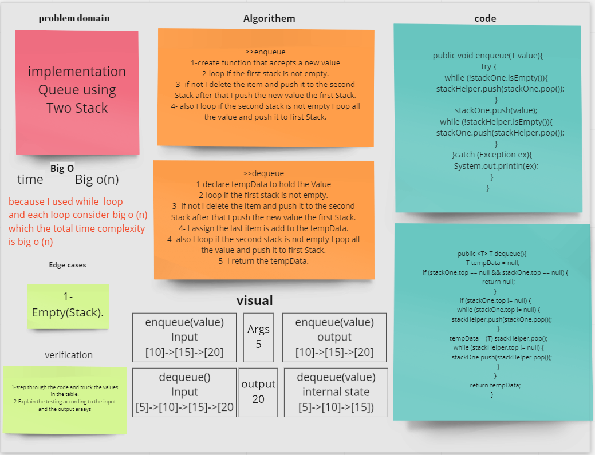

# Stacks and Queues
Stack A stack is a linear data structure in which elements can be inserted and deleted only from one side of the list, called the top. A stack follows the LIFO (Last In First Out) principle.
Queue: A queue is a linear data structure in which elements can be inserted only from one side of the list called rear, and the elements can be deleted only from the other side called the front. The queue data structure follows the FIFO (First In First Out) principle.

## Challenge
> * To implement stack & queue in this challenge we need three classes: "`Node`" and "`Stack`", "`Queue`".
> * The `Stack` class contains all the function we need to solve the methods that related to the Stacks, and before each function I write explanation.
> * The `Queue` class contains all the function we need to solve the methods that related to the Queues, also before each function I write explanation.

## Approach & Efficiency
`Stack` bigO(1) for push and pop and peek 
`Queue` bigO(1) for enQueue and deQueue and peek

## API

# stack 
`push:` adds a new node with that value to the top of the stack with an O(1) Time performance.
`pop:` Returns: the value from node from the top of the stack
`peek:` Returns: Value of the node located at the top of the stack
`is empty:` Returns: Boolean indicating whether or not the stack is empty.

# Queue
`enqueue:` adds a new node with that value to the back of the queue with an O(1) Time performance.
`dequeue:` Returns: the value from node from the front of the queue
`peek:` Returns: Value of the node located at the front of the queue
`is empty:` Returns: Boolean indicating whether or not the queue is empty

# code challenge 11

# Challenge Summary
Implement a Queue using two Stacks, Create a new PseudoQueue class. Do not use an existing Queue.
Instead, this PseudoQueue class will implement our standard queue interface (the two methods listed below),
but will internally only utilize 2 Stack objects.

## Whiteboard Process

## Approach & Efficiency
enqueue method => Big O = n.
dequeue method => Big O = n.

## Solution
`enqueue:` adds a new node with that value to the back of the queue with an O(1) Time performance.
`dequeue:` Returns: the value from node from the front of the queue

# code challenge 12

# Challenge Summary
To implement stack & queue in this challenge we need two classes: `Animal`, and "`AnimalShelter`".

## Whiteboard Process

## Approach & Efficiency
enqueue method => Big O = n.
dequeue method => Big O = n.

## Solution

Create a class called Animal to represent an animal in the shelter. 

Create a class called Dogs that extends Animal to represent a dog.

Create a class called Cats that extends Animal to represent a cat.

Create a class called AnimalShelter which holds only dogs and cats, The shelter operates using a first-in, first-out approach.
Implement the following methods:

enqueue(animal): adds animal to the shelter, Animal can be either a dog, or a cat object, This method has constant space and time complexity.

dequeue(pref): returns either a dog or a cat, If pref is not "dog" or "cat" then return.