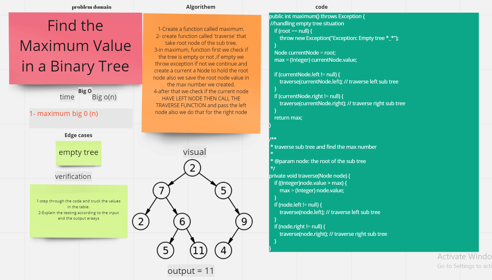

# Trees
Binary Trees, Binary Search Trees, and K-ary Trees.
We will review some common terminology that is shared amongst all of the trees and then dive into specifics of the different types.
## Challenge
Build all trees classes and methods from scratch

## Approach & Efficiency
* Create a Node class that has properties for the `data` stored in the node, the
  `left` child node, and the `right` child node.

* Create a BinaryTree class ,define a method for each of the depth first traversals
  called `inOrderTraverse`
  , `postOrderTraverse`, and
  `preOrderTraverse` which returns an array of the values, ordered appropriately.

* Create a BinarySearchTree class define a method named add that accepts a new node, and data with
  that data in the correct location in the binary search tree, define a method named contains that
  accepts a data, and returns a boolean indicating whether the data is in the tree at least once.
## API
* Class BinaryTree
    * `getRoot()` to get your root
    * `setRoot()` to set your root and insert a node inet
    * `inOrderTraverse()` send your root to get a data sorted left-root-right
    * `postOrderTraverse()` send your root to get a data sorted root-left-right
    * `preOrderTraverse()` send your root to get a data sorted left-right-root

* Class BinarySearchTree
    * `add()` insert in your tree u send just data.
    * `contains()` to get a `boolean` true or false after search in your tree
  
# code challenge 16

# Challenge Summary
Find the Maximum Value in a Binary Tree

## Whiteboard Process

## Approach & Efficiency
- `Big O of O(n)`
## Solution
`git clone git@github.com:Ali-coder1996/401-data-structures-and-algorithms.git`
`cd 401-data-structures-and-algorithms/tree`

`gradlew run`
`gradlew test`

